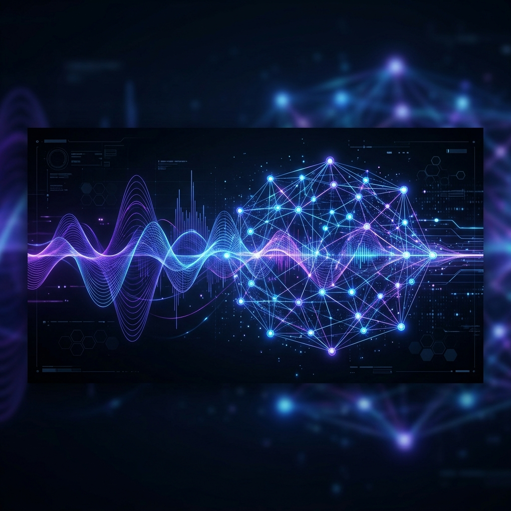
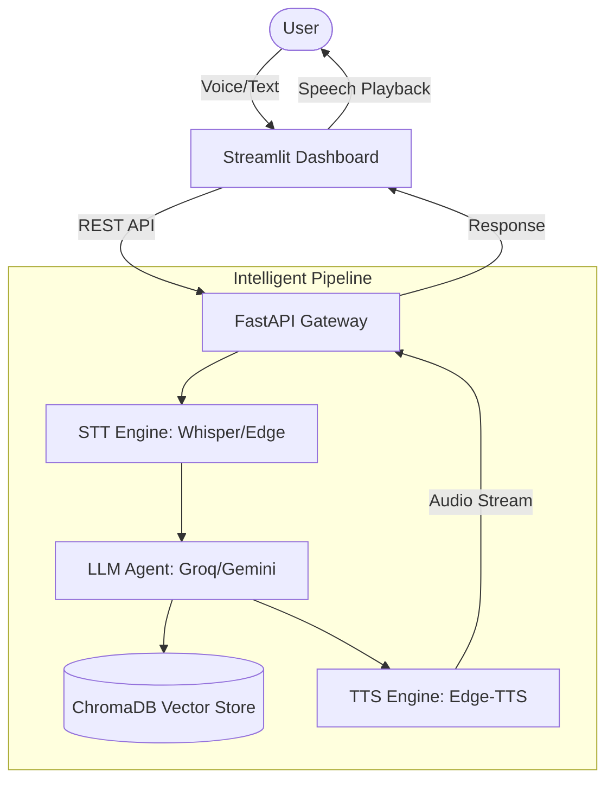
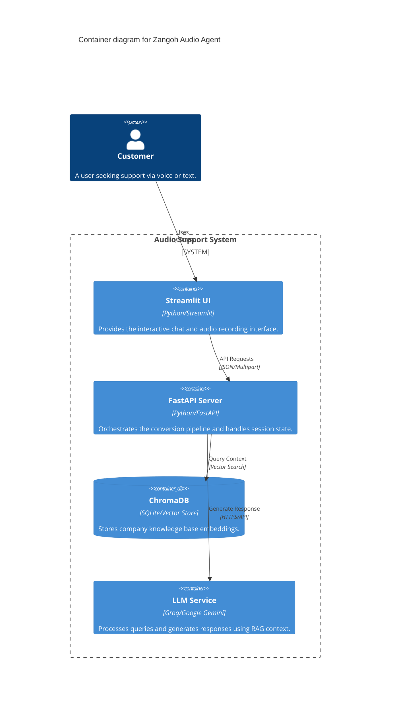
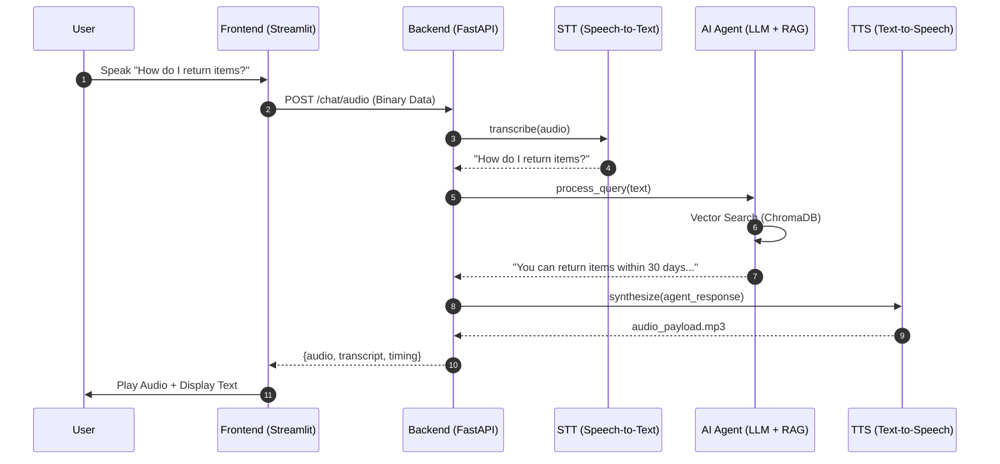
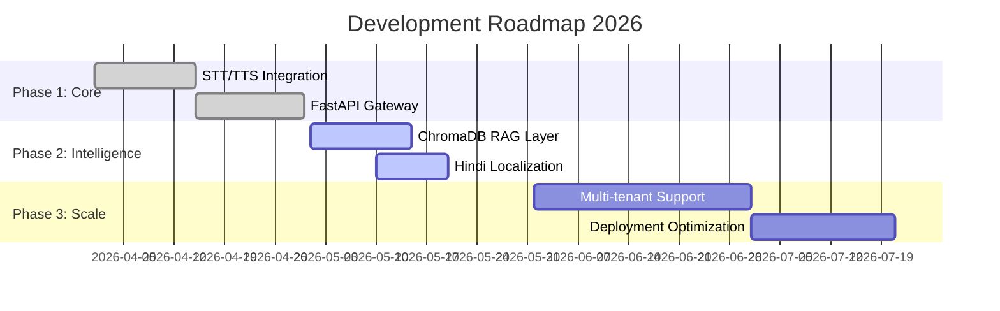
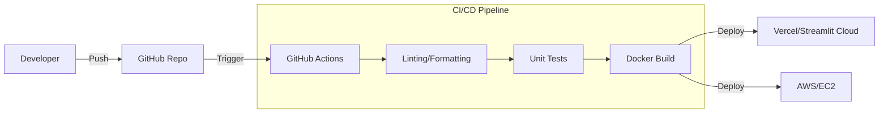
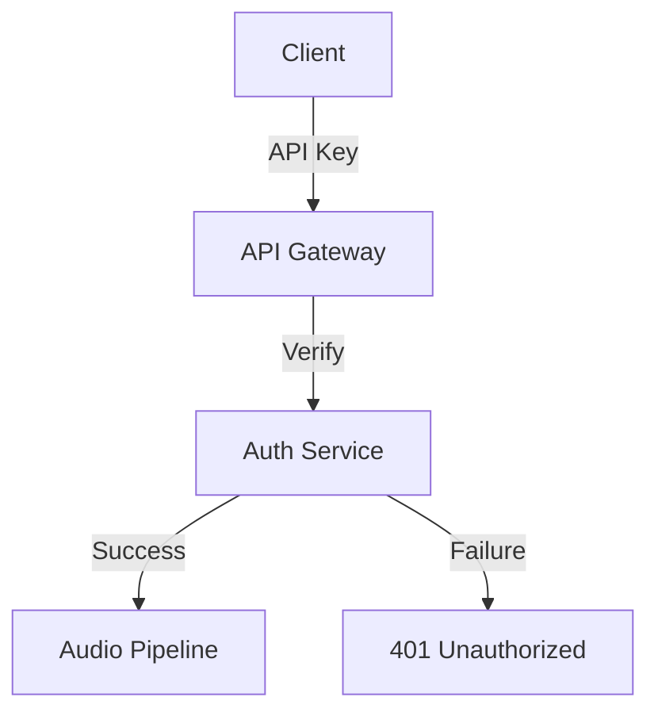

<div align="center">



# 🎙️ Zangoh GenAI Audio Support Agent
### *The Future of Intelligent, Multilingual Customer Interaction*

[](https://github.com/Ifrah27/Zangoh_GenAI/graphs/commit-activity)
[](https://github.com/Ifrah27/Zangoh_GenAI/releases)
[](https://fastapi.tiangolo.com/)
[](https://streamlit.io/)
[](LICENSE)

---

<p align="center">
  <b>A state-of-the-art conversational AI pipeline orchestrating Speech-to-Text (STT), Retrieval-Augmented Generation (RAG), and Text-to-Speech (TTS) to deliver a premium, low-latency customer support experience.</b>
</p>

[Explore Docs](docs/RAG_IMPLEMENTATION_GUIDE.md) • [View Demo](#-demo-walkthrough) • [Report Bug](https://github.com/Ifrah27/Zangoh_GenAI/issues) • [Request Feature](https://github.com/Ifrah27/Zangoh_GenAI/issues)

</div>


## 💎 Features

<div align="center">

| 🗣️ Voice-First | 🧠 RAG Intelligence | 🌍 Multilingual (Hindi/English) |
| :---: | :---: | :---: |
| Real-time STT/TTS pipeline with Indian accent support | Deep contextual understanding powered by ChromaDB | Seamless switching between English and Hindi |
|  |  |  |

</div>

- **Dynamic RAG Pipeline**: Injects official company policy directly into LLM prompts for zero-hallucination support.
- **Hindi Localization**: Special handling for Devanagari script and MadhurNeural voice synthesis.
- **Low Latency**: Optimized asynchronous execution for near-instant responses.
- **Premium UI**: Dark-mode optimized Streamlit interface with real-time waveform visualization.

---

## 🏗 System Architecture

### 🌐 High-Level Data Flow


### 🛰 C4 Container Diagram


### 🔄 API Lifecycle & Sequence


---

## 📂 Project Structure

```text
e:/audio_support_agent/
├── 📂 data/                # Vector database persistence
├── 📂 docs/                # Technical documentation & assets
├── 📂 src/
│   ├── 📂 api/             # FastAPI endpoints & middleware
│   ├── 📂 llm/             # RAG logic & LLM Agent wrappers
│   ├── 📂 stt/             # Speech-to-Text implementations
│   ├── 📂 tts/             # Text-to-Speech engines
│   └── 📜 pipeline.py      # Core orchestration logic
├── 📜 streamlit_app.py     # Frontend application
├── 📜 .env                 # Environment secrets
└── 📜 requirements.txt     # Dependency manifest
```

---

## 🛠 Technology Stack

- **Core**: Python 3.10+
- **API**: FastAPI, Uvicorn
- **Frontend**: Streamlit, Custom CSS
- **AI Models**: 
  - **LLM**: Groq (Llama 3), Google Gemini
  - **STT**: OpenAI Whisper, SpeechRecognition
  - **TTS**: Microsoft Edge TTS, gTTS
- **Vector DB**: ChromaDB

---

## 🚦 Roadmap & Lifecycle



---

## 🚀 Deployment & CI/CD


---

## 🔒 Security & Auth Flow


---

## 🤝 Contributing

1. Fork the Project
2. Create your Feature Branch (`git checkout -b feature/AmazingFeature`)
3. Commit your Changes (`git commit -m 'Add some AmazingFeature'`)
4. Push to the Branch (`git push origin feature/AmazingFeature`)
5. Open a Pull Request

---

<div align="center">
  
  <br>
  Built with ❤️ by <b>Ifrah</b>
</div>

